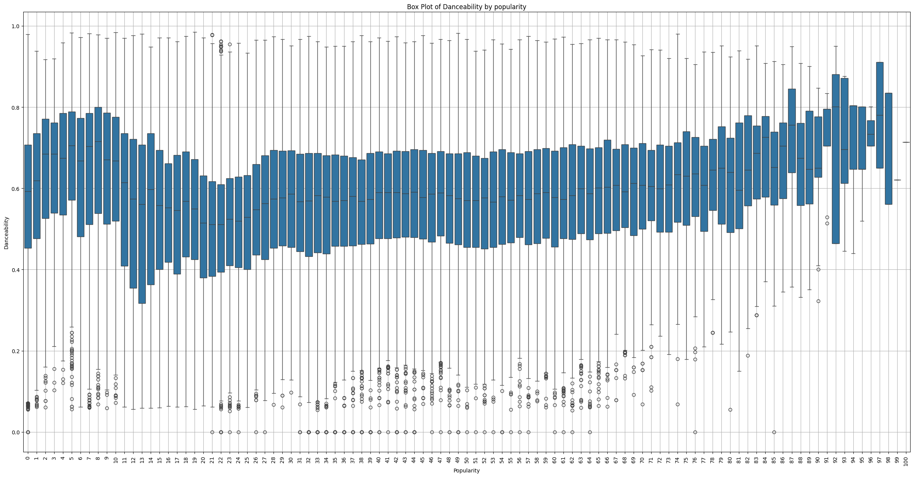
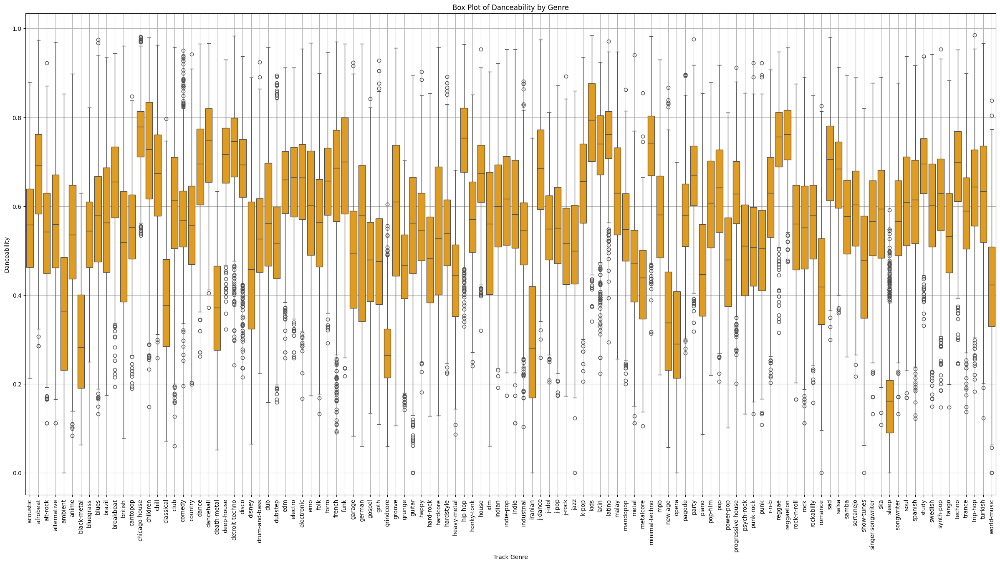
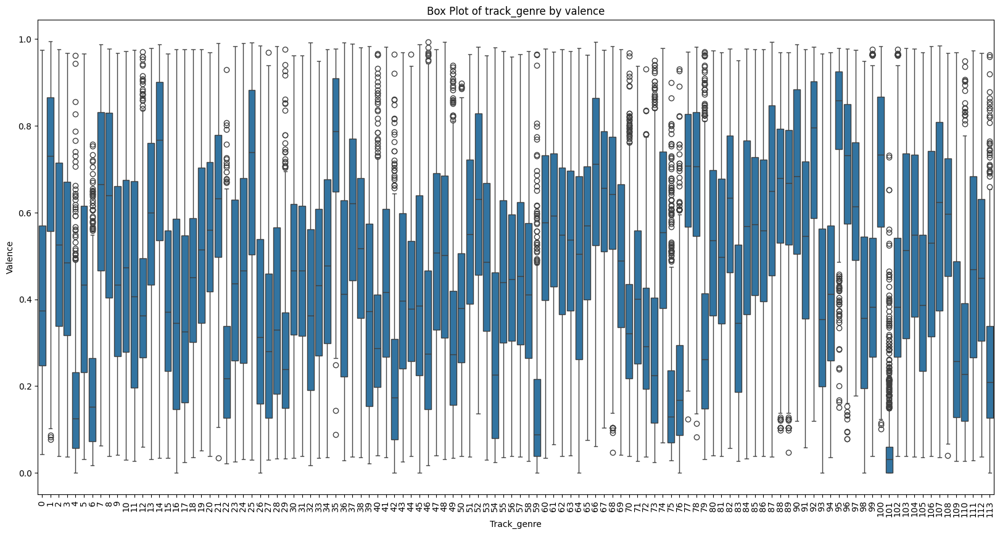
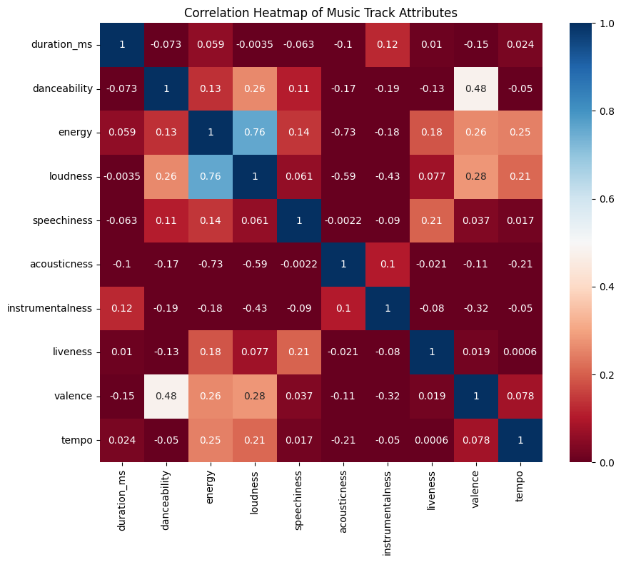
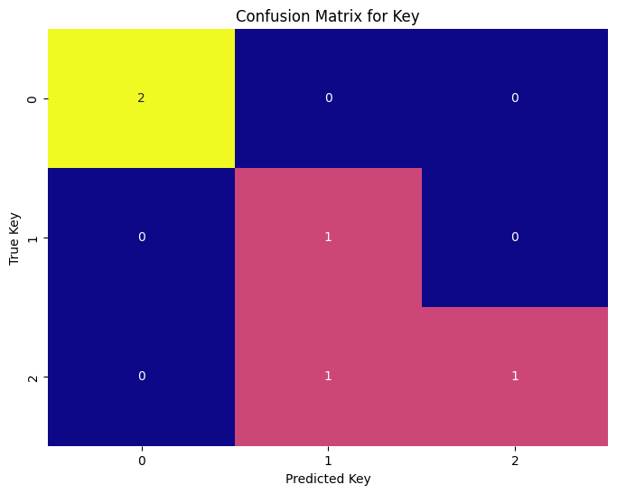
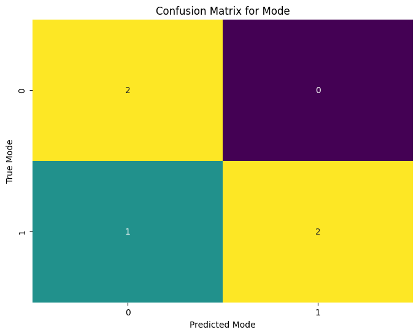
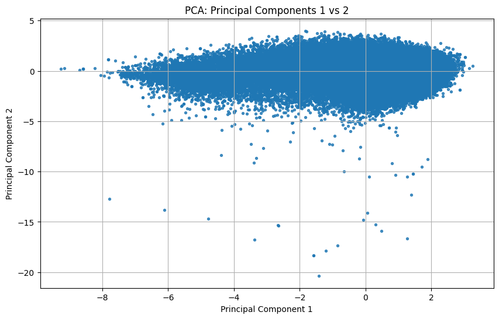
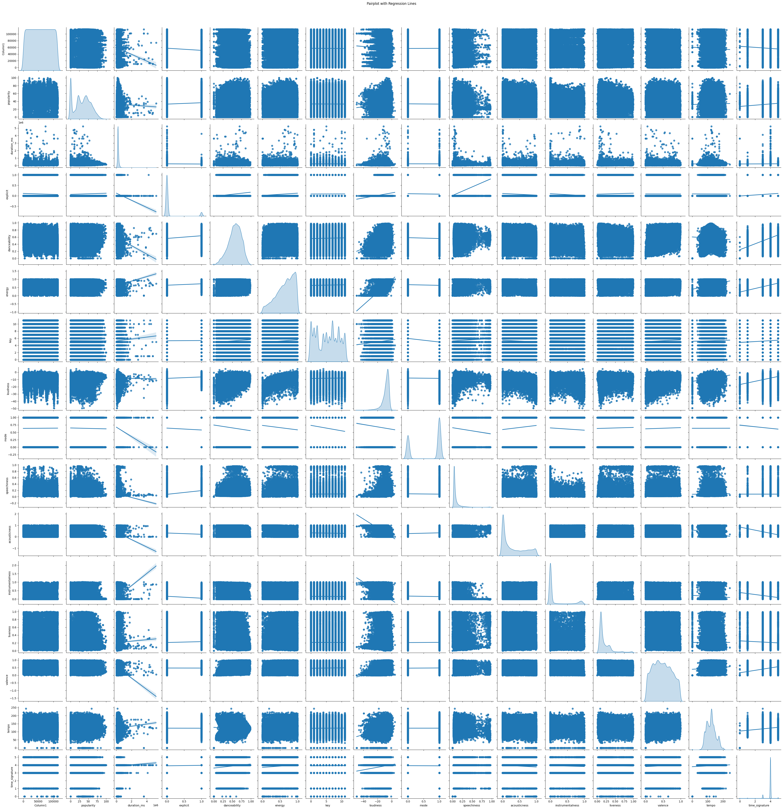
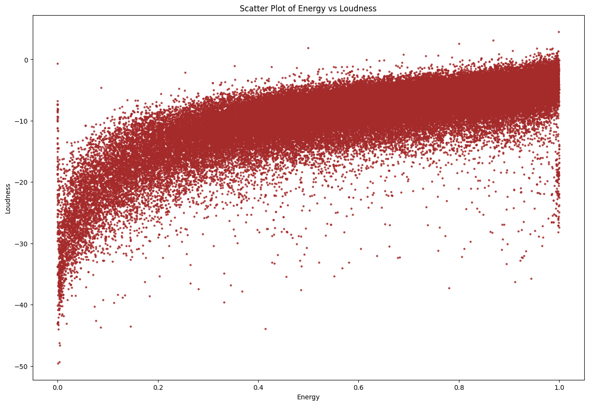

# 2024_ia651_Kandukuri_Dantuluri
#  Machine Learning Project Report: Spotify Song Popularity Prediction

## 1. Data Import and Initial Exploration

### Loading the Data
- The dataset spotify.csv is imported into a Datamodelingontaining various attributes of songs on Spotify, including genre, duration, danceability, energy, loudness, and popularity.

### Preliminary Inspection
- df.info() is utilized to provide a summary of the DataFrame, which helps identify columns with missing values or incorrect data types that need addressing.

## 2. Data Preprocessing

### Creating Dummy Variables
- The categorical variable 'track_genre' is converted into multiple binary variables (one-hot encoding), essential for models that handle only numerical inputs.

### Data Cleaning
- Columns irrelevant to the analysis such as 'Unnamed: 0' or 'track_id' are removed to reduce dimensionality and focus on meaningful attributes.

## 3. Exploratory Data Analysis (EDA)

### Visualization Techniques
- *Scatter Plots:* Explore the relationship between song duration and danceability.
- *Box Plots:* Analyze the distribution of danceability across different genres and its variation with song popularity.
- *Correlation Analysis:* A heatmap visualizes correlations among numerical features, providing insights into potentially predictive or redundant features.

### Dimensionality Reduction (PCA)
- PCA reduces the number of variables into principal components, simplifying visualizations and potentially enhancing model performance.

## 4. Feature Engineering

### Dummy Variable Adjustment
- Additional dummy encoding ensures all categorical data is transformed for model compatibility.

### Target Variable Transformation
- The 'popularity' feature is binarized, facilitating a change in problem type from regression to classification, depending on specific modeling goals.

## 5. Model Training and Evaluation

### Model Implementation
- *Random Forest and Linear Regression Models* are implemented to capture both linear and nonlinear relationships.
- *Performance Evaluation:* Metrics like MSE, MAE, and R-squared are used to quantify prediction errors and explanatory power.

### Hyperparameter Tuning
- *GridSearchCV* optimizes model parameters, enhancing model performance based on systematic parameter testing and cross-validation.

## 6. Feature Importance and Model Insights

### Determining Feature Importance
- Identifies which song attributes significantly influence popularity, guiding marketing strategies or further feature engineering.

### Model Diagnostics
- Adjusted R-squared values assess the model fit, providing a nuanced understanding of model performance considering the number of predictors.

## 7. Final Model Selection and Evaluation

### Optimization and Validation
This project uses a comprehensive approach to predict song popularity, applying rigorous data handling and advanced modelingfitting.

### Comparative Analysis
- Final evaluations and comparisons highlight the best model or parameters for predicting Spotify song popularity under current dataset conditions.

# Conclusion
This project uses a comprehensive approach to predict song popularity, applying rigorous data handling and advanced modeling techniques.

